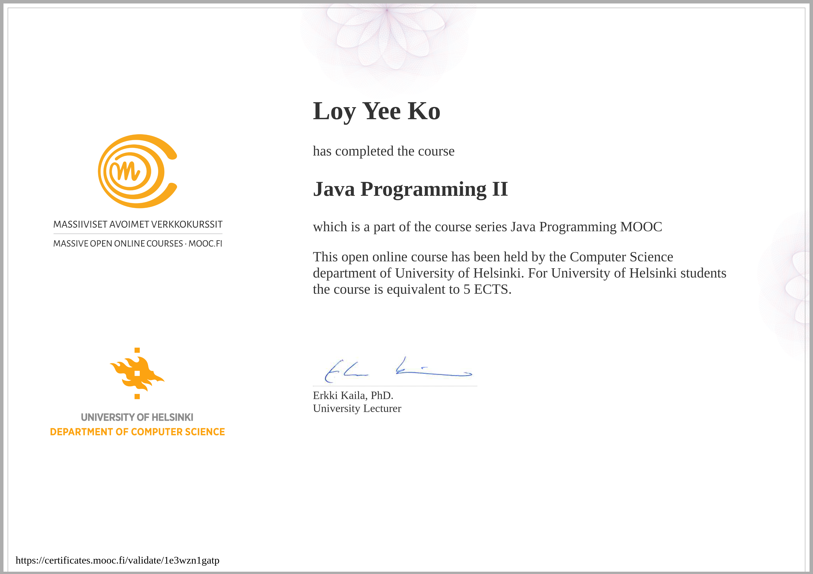

# Java Programming II MOOC (University of Helsinki)

Completed on 30th December 2023!

## Summary

This is the second part of the University of Helsinki MOOC on Java Programming. It is one of *the best* courses for learning Java and programming in general, highly recommended.

It covers the following topics:

- Streams API
- 2D Arrays
- Files reading
- Regular Expressions
- Interfaces
- Inheritance
- Polymorphism
- Enums
- Exceptions
- Graphical User Interface (JavaFX)
  - Event Handling
  - Scene Builder
  - State Management

### Worthwhile to look into in-depth

- Part 12_10 Magic Square - Algo and Traves the matrix.
- Part 13_07 TextStatistics2 - 2-way binding in JavaFX.
- Part 13_13 TicTacToe - 2D array and 2D array traversal and check for winner algorithmically.
- Part 14_03 SavingsCalculator - Interest and saving calculation with state handling.
- Part 14_05 CyclingStatistics - Streams API application.
- Part 14_07 Collage - Image manipulation and state management.
- Part 14_09 Asteroids - Game logic with state management.
